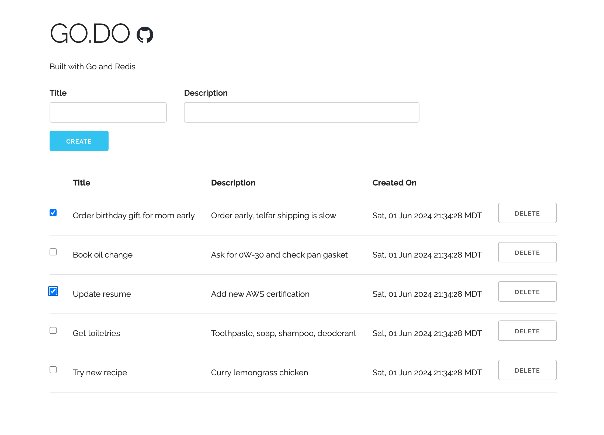

<h1 style="font-family:monospace">GO.DO</h1>
<div style="padding-bottom:20px">
    
    
    
</div>

<!-- DESCRIPTION -->
<h2 style="font-family:monospace">Description</h2>
<p style="font-family:monospace">
Go + Redis implementation of a todo list web application.<br>
Lightning fast, lightweight, and designed with excellent memory management.
</p>

<!-- INSTALLATION -->
<h2 style="font-family:monospace">Installation</h2>

<h4 style="font-family:monospace">Option 1: Docker</h4>

```bash
# 1) Install project
git clone https://github.com/ttamre/go.do.git
cd go.do

# 2) Build docker image
docker build -t go.do .
```

<h4 style="font-family:monospace">Option 2: Makefile</h4>

```bash
# 1) Install redis
# https://redis.io/downloads/

# 2) Install project
git clone https://github.com/ttamre/go.do.git
cd go.do

# 3) Build project
make
```

<!-- USAGE -->
<h2 style="font-family:monospace">Usage</h2>

<h4 style="font-family:monospace">Option 1: Docker</h4>

```bash
# For more information on how to configure ports and other flags with `docker run`,
# https://docs.docker.com/reference/cli/docker/container/run/#publish

docker run -p 8080:5000 go.do   # Run docker image and expose it at http://localhost:8080
```


<h4 style="font-family:monospace">Option 2: Makefile</h4>

```bash
# 1) Run Redis server in background
redis-server --port 5001 --daemonize yes

# 2) Run app
./bin/godo

# Command line arguments (optional)
#   listenAddr      port to serve website on  (default: 5000)
#   redisAddr       port to serve database on (default: 5001)
./bin/godo --listenAddr 5000 --redisAddr 5001
```

<!-- LICENSE -->
<h2 style="font-family:monospace">License</h2>
<p style="font-family:monospace">This project is licensed under the GNU v3 General Public License. For more information, see the <a href="LICENSE">LICENSE</a></p>


